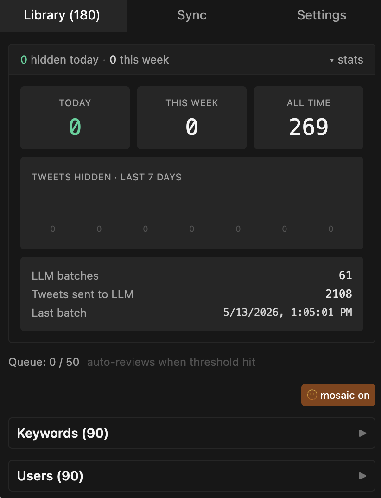
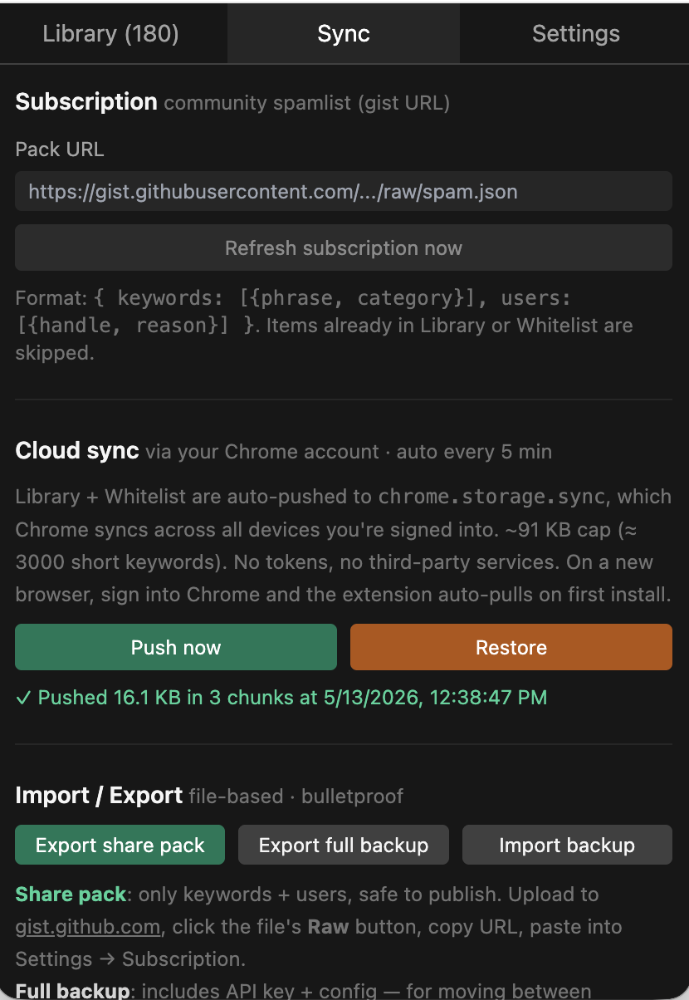
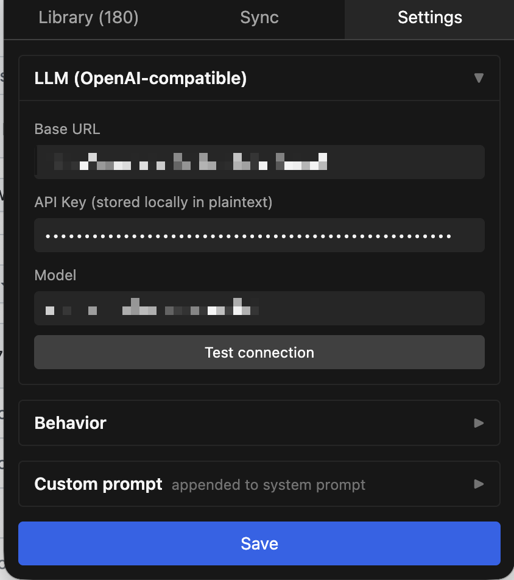

# XSpamCast

[English](./README.md) · [简体中文](./README.zh-CN.md) · [GitHub](https://github.com/kayw-geek/x-spam-cast)

> **A spam filter for X/Twitter that hides obvious junk the moment you install — a bundled starter list catches the common patterns. Bring your own LLM key (optional) and it learns new spam from your own feed automatically. Your block list backs up across browsers via your Chrome sign-in.**

[](./LICENSE)
[](https://developer.chrome.com/docs/extensions/develop/migrate/what-is-mv3)
[](#-cross-device-backup)
[](https://github.com/kayw-geek/x-spam-cast/issues)
[](https://github.com/kayw-geek/x-spam-cast)

A Chrome extension that hides spam tweets in your X feed by matching them against a local pattern library. Everything happens in your browser — your feed gets cleaner without anything you write or browse leaving your machine. The library starts off with a built-in pack and grows three ways: community subscriptions, an optional LLM that mines new patterns from your feed, or a single click on the 🚮 button next to any spam tweet you spot.

> **It converges.** Every spam pattern the LLM finds becomes a permanent local rule. Once your library has tasted enough of your feed, the LLM is barely called at all — daily cost trends toward $0.

---

## ✨ Why this is different

- 🚀 **Day-1 value.** A built-in starter pack hides obvious spam the moment you load the extension. Open x.com and it just works.
- 🧠 **It learns from your own feed.** Plug in any OpenAI-compatible LLM key and unfamiliar tweets get auto-mined for new spam patterns. The library grows on its own.
- 🔒 **Filtering happens locally.** Tweets are matched against your library inside the browser — nothing about what you read leaves your machine. Tweet text only travels when the LLM is mining a batch.
- 📦 **Subscribe to community packs.** Got a friend with a great spam library? Paste their gist URL and inherit hundreds of pre-curated patterns instantly.
- ☁ **Cross-device backup just works.** Your library follows you to any browser where you're signed into Chrome.
- ↩ **Undo on delete.** Misclick? A 6-second undo toast restores the item.
- 🚮 **One-click manual mark.** A trash button on every tweet — click to block the author and feed the LLM ground-truth training data.
- 🧬 **Custom prompt for niche feeds.** Free-form rules in any language — perfect for language-specific spam (Chinese 引流, crypto airdrops, etc.).
- 🚫 **Zero telemetry.** The extension talks only to: your LLM endpoint, x.com (read-only DOM), and your subscription URL.

---

## 📺 What you'll see

### Library — your block list, with stats

<p align="center">
  
</p>

Top strip shows what got hidden today and this week; expand `▼ stats` for the 7-day chart. Below that, the full library — Keywords and Users are collapsed by default, sorted newest-first. Tap **🫥 mosaic** to blur the contents (work-safe). Click `delete` on any item to remove it; a 6-second **Undo** toast saves you from misclicks.

### Sync — subscriptions, cloud sync, file export

<p align="center">
  
</p>

- **Subscription** — paste any public spamlist URL (a gist `Raw` link works) and your library inherits everything in it. Auto-refreshes daily.
- **Cloud sync** — backs up to Chrome's account sync every few minutes. Restore on a fresh install just by signing into Chrome.
- **Import / Export** — JSON file workflow. **Export share pack** writes a sanitized file (no API key, no settings) you can publish to gist or send to a friend. **Export full backup** keeps everything including your API key — never share publicly. **Import file** auto-detects the format: share packs merge into your library, full backups replace it.

### Settings — LLM, behavior, custom prompt

<p align="center">
  
</p>

Accordion layout. Only **LLM** opens by default — the rest stay folded until you need them:

- **LLM (OpenAI-compatible)** — Base URL + API Key + Model. **Test connection** auto-fills the model picker.
- **Behavior** — Hide style: `collapse` (clickable banner with reason) or `nuke` (totally gone).
- **Custom prompt** — domain notes in any language that the LLM uses on top of the built-in heuristics. Useful for niche-feed vocabulary (e.g. Chinese 引流 phrases, crypto scam signals).

---

## 🚀 Install

> Not on the Chrome Web Store yet.

### Option A — Pre-built release

1. Grab the latest `xspamcast-*.zip` from [Releases](https://github.com/kayw-geek/x-spam-cast/releases)
2. Unzip into a folder you'll keep
3. `chrome://extensions` → toggle **Developer mode** → **Load unpacked** → pick the folder
4. Pin from the puzzle-piece menu

### Option B — From source

```bash
git clone https://github.com/kayw-geek/x-spam-cast
cd x-spam-cast
pnpm install
pnpm build      # → dist/chrome-mv3/
```

Load `dist/chrome-mv3/` in `chrome://extensions` → Load unpacked.

---

## ⚙️ First run

After install, just open x.com. The starter pack is already active — obvious spam disappears immediately.

To unlock LLM auto-training (optional but recommended):

1. Settings → expand **LLM** → paste an OpenAI-compatible endpoint + API key
2. Click **Test connection** — auto-fills the model picker
3. Click **Save**
4. Browse normally. Every 50 unfamiliar tweets triggers one LLM batch.

A typical batch is ~3K in / ~500 out. **Daily cost converges toward $0.01.**

---

## ☁ Cross-device backup

Your library backs up automatically every few minutes via Chrome's built-in account sync — the same mechanism that syncs your bookmarks. Sign into Chrome on another machine, install the extension, and your library is restored on first run.

If your library grows past Chrome's sync limit (~3000 short keywords), use **Sync → Export full backup** to download a JSON file and re-import it anywhere.

---

## 🌐 Community packs

Paste any public spamlist URL into Sync → Subscription and your library inherits it. The extension re-checks the URL daily.

### Share your trained library

After a few days, your library is worth sharing:

1. **Sync → Export share pack** to download a sanitized JSON
2. Upload it as a public [gist](https://gist.github.com)
3. Send the **Raw** URL to anyone — they paste it into Sync → Subscription

---

## 🌍 Localizing / domain tuning via Custom prompt

The built-in prompt is generic English. Teach the LLM your domain via **Settings → Custom prompt**. Free-form, any language.

Use it to:

- **Whitelist topics** — "I follow stock analysis, don't flag stocks/futures as spam"
- **Force-block patterns** — "Treat any 'meme coin airdrop' mention as scam"
- **Exempt accounts** — "Never block @nytimes regardless of content"
- **Inject domain vocabulary** — language-specific lure phrases, character substitutions (e.g. `chu男` → `处男`)

---

## 🧪 Development

```bash
pnpm dev      # hot-reload dev build
pnpm test     # vitest
pnpm compile  # tsc --noEmit
pnpm build    # production → dist/chrome-mv3/
```

Stack: **TypeScript** · **[WXT](https://wxt.dev)** · **React 18** · **Tailwind 3** · **Vitest** · **Zod**.

---

## 🔒 Privacy

- 🔑 **LLM API key**: stored as plaintext in `chrome.storage.local` (MV3 has no encrypted secret store). Mitigate with low-spend-cap relay keys.
- 🌐 **Tweet text**: sent **only to your configured LLM endpoint**, only during batch analysis. Local match path never transmits anything.
- 📡 **No telemetry, no analytics, no error reporting service.** Outbound destinations: your LLM endpoint, x.com (DOM only), your subscription URL.
- ☁ **chrome.storage.sync**: encrypted in transit/at rest by Chrome, scoped to your Google account. We never see it.
- 📦 **Share pack export**: deliberately strips API key + config. **Full backup** export keeps the API key — never publish that one.

---

## ❓ FAQ

**Q: Does it touch my Twitter mute settings?**
No. The extension never logs into the Twitter API and never modifies anything on x.com — it only reads the page you're already looking at and hides spam tweets locally. If you uninstall, x.com goes back to its default state.

**Q: What if I uninstall? Will spam come back?**
Yes. The extension is the only thing doing the filtering. If you want spam to stay hidden after uninstall, copy your Library into Twitter's own muted-keywords list manually (Sync → Export, open the JSON, paste each phrase into x.com's Settings → Privacy → Mute and block).

**Q: Will it block legitimate accounts?**
Sometimes. **Delete from Library = auto-whitelist** — once you reject a pattern, the LLM won't propose it again. The 6-second Undo on delete saves misclicks.

**Q: My language has weird spam the built-in prompt misses.**
Paste rules into Settings → Custom prompt. See the "Localizing" section for a Chinese-feed example.

**Q: Does it work on twitter.com or only x.com?** Both.

**Q: What if X redesigns the timeline?**
The extension may stop catching tweets correctly. [File an issue](https://github.com/kayw-geek/x-spam-cast/issues) and it'll get patched.

**Q: What if I clear browser data?**
Reinstall the extension — Chrome's account sync restores your Library + Whitelist on first launch. As a belt-and-braces backup, also use **Sync → Export full backup** occasionally to save a JSON file.

**Q: Can I use a model other than DeepSeek?**
Yes — any OpenAI-compatible endpoint. DeepSeek is the cheapest sane default for Chinese feeds.

**Q: How big can the Library get?**
Effectively unbounded for local runtime. The cross-device cloud backup caps at ~91 KB (≈ 3000 short keywords); beyond that, cloud sync will tell you it's too big and ask you to use **Export full backup** (file) for cross-device transfer.

---

## 🗺 Non-goals

- **Not a translator, not a feed curator, not a recommendation tweaker.** Just removes spam.
- **Not a generic AI agent.** The LLM does one job: extract spam patterns from a batch of tweets.
- **No mobile.** Browser extension only.

---

## 🤝 Contributing

PRs welcome — see [Issues](https://github.com/kayw-geek/x-spam-cast/issues). Especially:

- **Curated starter packs** for different language feeds (share as gist URL in an issue)
- **Custom-prompt snippets** for niches (crypto Twitter, k-pop, finance, etc.)
- **Resilience fixes** for X DOM changes

---

## 📜 License

[MIT](./LICENSE)
