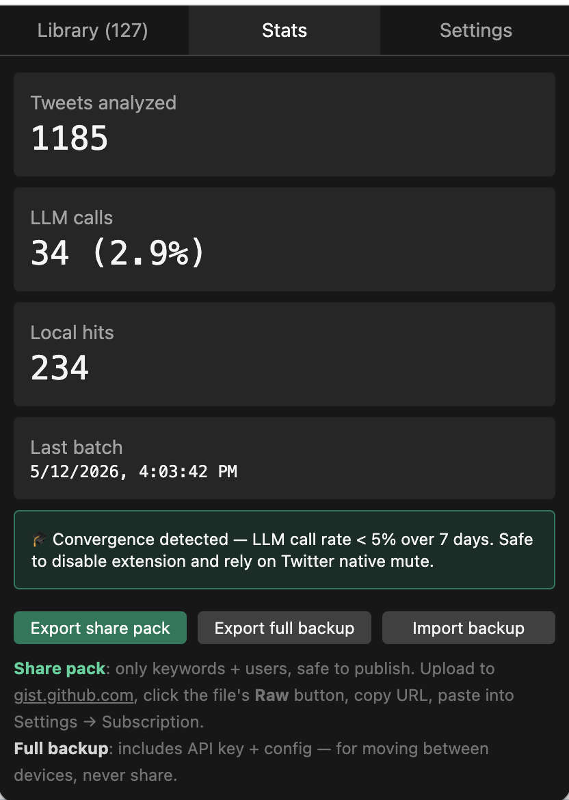
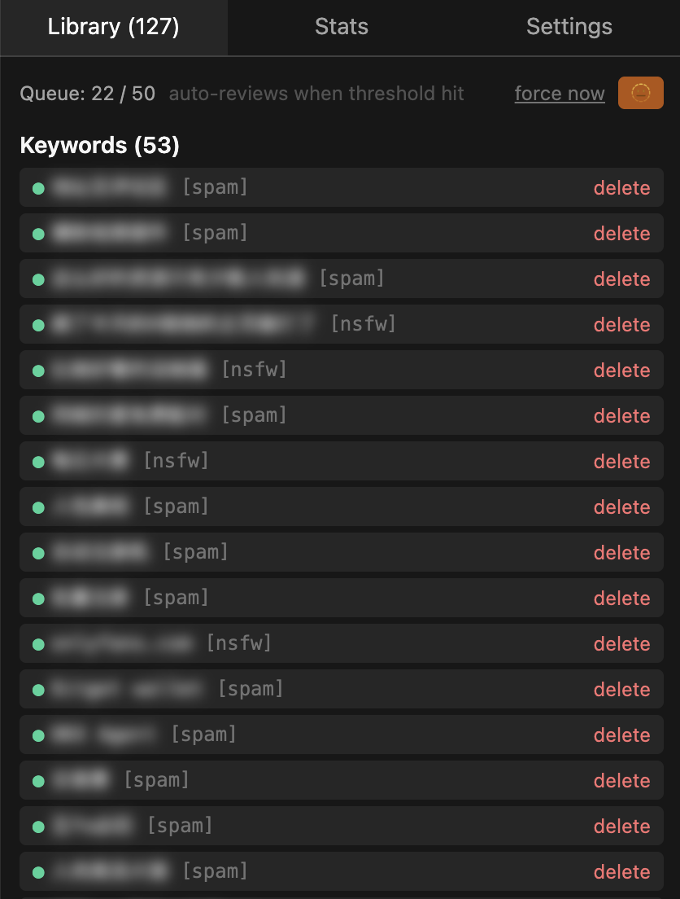

# XSpamCast

> **LLM-powered spam filter for X/Twitter — subscribe to community spam packs, or train your own in 3 days. Then it mostly stops calling the API.**

[](#)
[](#license)
[](#)
[](#)

A Chrome extension that watches your feed, batches unknown tweets, and asks an LLM (your key, your model) to extract spam patterns. Verdicts get pushed to Twitter's native mute list — so the spam stays gone even when the extension is off. The system **converges**: as the local list grows, LLM calls drop toward zero.

> **Built-in prompt is language-agnostic** (English, generic spam heuristics). For language-specific patterns (Chinese 引流, German Werbung, crypto pump-and-dump templates) just paste your domain rules into **Settings → Custom prompt** — no code changes, no fork.

<p align="center">
  
</p>

> **Real run after 1 week**: 1,185 tweets analyzed, only 34 LLM calls (2.9%), 234 caught locally with zero LLM cost. The extension detects convergence and tells you when it's safe to disable.

---

## ✨ Why this is different

- 🧠 **LLM is a bootstrap, not a runtime.** Most "AI" filters call the LLM on every tweet. This one batches, learns, then stops.
- 🎯 **Sinks into Twitter's native mute.** Patterns the LLM finds get pushed to x.com's own mute list — works even with the extension off.
- ♻️ **Whitelist on rollback.** Delete a misjudged item → auto-whitelisted → LLM never proposes it again.
- 📦 **Subscribe to community packs.** Skip the cold start with a shared spamlist URL (any public JSON gist).
- 💾 **Auto-backup to private gist.** Trained list survives browser resets and migrates across devices.
- 🧬 **Custom prompt block.** Append domain rules / language patterns / personal exemptions in any language. No fork, no PR. Highest priority — overrides built-in heuristics on conflict.
- 🚮 **One-click manual mark.** Spotted spam yourself? One button mutes the user *and* feeds the tweet to the LLM as ground-truth training data.
- 🔒 **Zero telemetry.** Talks only to your LLM endpoint, x.com, your subscription URL, and (optionally) GitHub for backup. That's it.

---

## 🚀 Install

> Not yet on the Chrome Web Store. Pick one of the two paths below.

### Option A — Pre-built release (recommended for non-devs)

1. Go to the [Releases page](https://github.com/kayw-geek/x-spam-cast/releases) and download the latest `xspamcast-*.zip`
2. Unzip into a folder you'll keep (e.g. `~/chrome-extensions/xspamcast/`) — Chrome reads the unpacked folder, so deleting it disables the extension
3. Open `chrome://extensions` → toggle **Developer mode** on (top-right)
4. Click **Load unpacked** → pick the unzipped folder (the one containing `manifest.json`)
5. Pin the extension icon from the Chrome toolbar's puzzle-piece menu

### Option B — Build from source

```bash
git clone https://github.com/kayw-geek/x-spam-cast
cd x-spam-cast
pnpm install
pnpm build                 # → dist/chrome-mv3/
```

Then load `dist/chrome-mv3/` into Chrome via `chrome://extensions` → **Load unpacked** (steps 3-5 above). Or run `pnpm dev` for hot-reload during development.

---

## ⚙️ First-run configuration

After installing, click the extension icon → **Settings**:

1. Paste your LLM endpoint (`https://api.deepseek.com/v1` for DeepSeek) + API key
2. Click **Test connection** — auto-fills the model picker if `/models` is exposed
3. Pick a model, click **Save**
4. (Optional) **Subscription** → paste a community pack URL for instant cold-start
5. (Optional) **Backup** → paste a GitHub PAT (`gist` scope) → click **Push backup now** to enable cross-device sync
6. Browse x.com normally

That's it. The extension watches your feed, batches at 50 tweets, calls the LLM once, applies verdicts automatically.

### Recommended LLM

| Provider | Endpoint | Notes |
|---|---|---|
| **DeepSeek** (recommended for Chinese) | `https://api.deepseek.com/v1` | ¥1/M tokens, perfect Chinese |
| OpenAI | `https://api.openai.com/v1` | gpt-4o-mini works for any language |
| Anthropic via gateway | (your relay URL) | Claude Haiku is excellent at this |
| Any OpenAI-compatible relay | (your relay URL) | OneAPI, gateways, etc. |

A typical batch is ~3K tokens in / ~500 out. **Daily cost converges to roughly $0.01.**

---

## 📺 What you'll see

### In your feed
- Spam tweets disappear (`collapse` shows a clickable banner, `nuke` makes them vanish entirely)
- A small 🚮 button on each tweet — click to manually mark + train

### In the popup

<p align="center">
  
</p>

The **Library** tab is your central console: queue progress, learned keywords (● green = synced to Twitter mute, ○ amber = local-only), users, whitelist. The 🫥 toggle blurs all spam phrases — work-safe demo mode. Hover any row to peek.

### Settings + Subscription + Backup

<p align="center">
  
</p>

---

## 🌐 Subscribe to community packs

Skip days of training. Paste a public spamlist URL into Settings → Subscription:

1. Find a pack (or make one — see below)
2. Settings → Subscription → paste raw URL
3. **Refresh now** → your Library fills with 100+ pre-curated spam patterns
4. Auto-refreshes every 24h

### Share your trained pack

After a few days, your trained list is gold. Share it:

1. Stats tab → **Export share pack** (no API key, no config — safe to publish)
2. Upload the JSON to [gist.github.com](https://gist.github.com), set Public
3. Click **Raw**, copy the URL
4. Anyone can subscribe, including your future self on a new browser

Pack format (intentionally minimal):

```json
{
  "version": 1,
  "name": "Chinese X spam pack v2",
  "keywords": [
    {"phrase": "加vx日结", "category": "spam"},
    {"phrase": "🥵👅", "category": "nsfw"}
  ],
  "users": [
    {"handle": "spammer123", "reason": "repetitive shill"}
  ]
}
```

---

## 💾 Auto-backup to private gist

Browser data can vanish — clearing site data, profile reset, switching machines. The trained spam library represents days of work; back it up automatically to a private GitHub gist.

**Setup once:**

1. Generate a [fine-grained PAT](https://github.com/settings/tokens?type=beta) — only the `gist` permission is needed
2. Settings → Backup → paste token, leave Gist ID empty
3. Toggle **Auto-push every 10min when Library or Whitelist changes**
4. Click **Push backup now** — extension creates a private gist, fills in the ID, shows the URL

**From now on:** every change to your Library or Whitelist marks the state dirty; the next 10-minute interval pushes a fresh snapshot to your gist. No-op if nothing changed.

**On a new browser:**

1. Install extension → Settings → paste same token + same Gist ID
2. Click **Pull restore** → Library + Whitelist + handle cache restored
3. (Or just let auto-pull at startup do it — runs when local Library is empty)

Backed up: `learned`, `whitelist`, `cache`. **Not** backed up: API key, LLM endpoint, stats, queue. (Those are device-specific.)

---

## 🛠 Architecture

```
┌──────────────────┐       ┌──────────────────────┐       ┌──────────────────┐
│  Content script  │       │  Background worker   │       │  Popup (React)   │
│  • observe DOM   │──msg──▶  • Queue             │◀──────│  • Library       │
│  • local match   │       │  • LLM batch         │       │  • Settings      │
│  • 🚮 button     │       │  • Twitter mute sync │       │  • Subscription  │
│  • hide tweet    │◀──────│  • Subscription pull │──msg──▶  • Backup       │
└──────────────────┘       │  • Gist backup push  │       └──────────────────┘
                           └──────────────────────┘
                                       │
                                       ▼
                           ┌─────────────────────────┐
                           │  chrome.storage.local   │
                           │  • config + secrets     │
                           │  • learned + whitelist  │
                           │  • queue + auth + cache │
                           └─────────────────────────┘
```

Twitter mute syncing uses **UI automation** (opens x.com in a background tab, drives the settings page) because X's mute API requires an anti-bot `x-client-transaction-id` that browser extensions can't generate.

---

## 🌍 Localizing / domain tuning

The built-in prompt is generic English. To teach the LLM about your specific spam patterns — Chinese 引流, German Werbung, crypto airdrops, NSFW patterns from a specific subculture, whatever — just paste rules into **Settings → Custom prompt**. No source edits.

Example for Chinese spam:

```
You are filtering a feed dominated by Chinese tweets.

Common Chinese spam patterns:
- Display-name lures: vx号, tg号, 看简介, 加薇xinxin
- Character substitution: vx → ㄨx, 微信 → 薇, 加 → 嘉
- Pure emoji + gibberish templates: "🥵👅l♨04💘iUW"

Keyword extraction (Chinese-specific):
- candidate_keywords phrase must be ≥3 Chinese characters (or Chinese + Latin digits)
- Prefer specific multi-character patterns over single common words

Cluster examples:
- 7 tweets contain "日结+vx" → keyword "日结+vx"
- 5 tweets contain "私我聊" → keyword "私我聊"

JSON safety: when quoting Chinese text inside reason/phrase fields, use 「」 or full-width "" — never ASCII ".
```

The LLM treats the custom block as **highest priority** — your rules override built-in heuristics on conflict. Use to:

- **Whitelist topics**: "I follow stock analysis — don't flag stocks/futures as spam"
- **Force-block patterns**: "Treat any 'meme coin airdrop' mention as scam"
- **Exempt accounts**: "Never mute @nytimes regardless of content"
- **Inject domain vocabulary**: language-specific lure phrases, regional scam patterns, NSFW substrings

Custom prompts are part of the backed-up state, so they sync across devices via the gist backup.

---

## 🧪 Development

```bash
pnpm dev              # hot-reload dev build
pnpm test             # vitest, ~35 tests
pnpm compile          # tsc --noEmit, strict mode + exactOptionalPropertyTypes
pnpm build            # production build → dist/chrome-mv3/
pnpm zip              # → .output/xspamcast-*.zip for store submission
```

Stack: **TypeScript** · **[WXT](https://wxt.dev)** (MV3 framework) · **React 18** · **Tailwind 3** · **Vitest** · **Zod**

---

## 🔒 Privacy

- 🔑 **Secrets** (LLM API key, GitHub PAT): stored as plaintext in `chrome.storage.local`. This is a Chrome MV3 limitation — there's no encrypted secret store available. Mitigate with low-spend-cap relay keys + fine-grained PATs scoped only to `gist`.
- 🌐 **Tweet text**: sent **only to your configured LLM endpoint**, only during batch analysis. The local match path never transmits anything.
- 📡 **No telemetry**: no phone-home, no analytics, no error reporting service. Outbound destinations: LLM endpoint, x.com (UI automation), your subscription URL, and (optionally) `api.github.com` for backup.
- 📦 **Share packs are public**: the export deliberately strips API keys, config, and stats. Anything you upload to a public gist is public — that's the point.
- 🗄 **Backup gists are private** by default (created with `public: false`).

---

## ❓ FAQ

**Q: Why not just use Twitter's built-in mute?**
You have to manually find every spam pattern. This automates discovery via LLM, then dumps results into Twitter's native mute so you get the same end result with no manual effort.

**Q: Will it block legitimate accounts?**
False positives happen. That's why **delete from Library = auto-whitelist** — once you reject a pattern, the LLM won't propose it again. For systematic exemptions (e.g. "never block @nytimes"), put a rule in Settings → Custom prompt instead of waiting for the LLM to misjudge.

**Q: My language / niche has weird spam patterns the built-in prompt misses. What do I do?**
Paste rules into Settings → Custom prompt. Free-form, any language, marked as highest priority. See the "Localizing / domain tuning" section for a worked Chinese example.

**Q: Does it work on twitter.com or only x.com?**
Both. The content script matches both hosts.

**Q: Why does syncing to Twitter take 1-30 seconds per item?**
X's mute API requires an anti-bot fingerprint we can't replicate, so we drive their UI in a background tab. It's hacky but it works. Items hide locally instantly; Twitter native mute catches up in the background.

**Q: Can I use a model other than DeepSeek?**
Yes — any OpenAI-compatible endpoint (OpenAI, Anthropic via gateway, OneAPI relays, etc.). DeepSeek is recommended for Chinese cost/quality balance; for English, gpt-4o-mini or Claude Haiku work great.

**Q: What if I clear browser data and lose my trained list?**
Set up the gist backup in Settings → Backup. Auto-pushes every 10 min, restores in one click on any browser.

**Q: What if X redesigns their settings page and breaks the UI automation?**
Selectors will need updating. Open an issue with what broke. The local DOM hide path is independent and keeps working.

---

## 🗺 Non-goals

- **Not a translator, not a feed curator, not a recommendation tweaker.** Just removes spam.
- **Not a generic AI agent.** The LLM does one job: extract spam patterns from a batch of tweets.

---

## 🤝 Contributing

PRs welcome. The repo is small (~3k LOC), structured as:

```
entrypoints/      WXT entry points (background, content, popup, sniffer)
src/core/         types, schemas, storage, messaging — pure
src/content/      DOM observation + scoring + hiding
src/worker/       LLM client, batch analyzer, mute sync, subscription, gist backup
src/popup/        React components
tests/            vitest, mirrors src/ structure
```

Particularly welcome:
- Curated starter packs (Chinese, English, Japanese, etc.) — share your trained list as a gist URL
- Public custom-prompt snippets for specific niches (crypto Twitter, k-pop fans, finance, etc.)
- Selector resilience for X redesigns
- Stats dashboard improvements (cost projections, time-series charts)

---

## 📜 License

MIT
